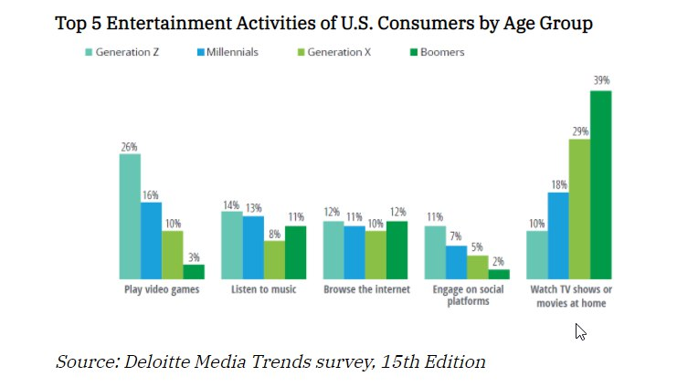

# PROYECTO QUEVEDOFEST

Responsable: Sandra Lucioni Curay, estudiante de Desarrollo de Aplicaciones Web, 1ºB.

## Introduccion

He decidido realizar el trabajo sobre el area de comunicación de la empresa del festival de QuevedoFest, donde se dividen
en dos grandes grupos: márketing y publicidad. 

Cuando se habla de estrategia de marketing para festivales o eventos musicales se puede resumir en <u>vender la experiencia</u>.
En estos planes, la estrategia principal es convencer al posible público de asistir y que experimentará una experiencia única. Y
que en el momento en el que se consiga, asegurarse de su asistencia al año siguiente (o siguiente edición).

La estrategia de comunicación está ligada a realizar una perspectiva gira de medios, difundir la celebración del evento por redes sociales u otros, establecer canales de difusión, las formas de hacerlo y concretar campañas de comunicación novedosas para ganar la mayor visibilidad poblie, es decir que llegue a mucha cantidad de gente, que es el posible público o consumidor.

Para ello estudiaremos y segmentaremos el público objetivo, que lleva a ser buscar y estudiar los gustos del público al que quieres destinar
tu actividad. En este caso, en el Quevedo Fest, dirigiremos a el público más "_indie_" donde habrá una balanaza equilibrada de artistas _mainstreams_ e _indies_ . Conocer a tu publico significa caracterizarlos conociendo sus tendencias y preferencias del grupo.

Los festivales suele tener un precio algo elevado dentro de la economía de la gente. Por eso es importante destacar entre la competencia.

Una vez descritos los objetivos del área, vamos a definir los dos grupos donde se separan.

### Publicidad:

La publicidad se define por un conjunto de estrategias orientadas a dar a conocer productos y servicios a la sociedad. Es necesario realizar una comunicacion patrocinada para poder posicionarse en la mente del consumidor como <u>algo de buena calidad</u>.

Existen varios tipo de publicidad:

- Publicidad _offline_. Siendo los principales: publicidad en prensa, publicidad en radio, publicidad en TV, publicidad exterior o publicidad directa.

- Publicidad _online_. Existiendo un agran variedad: vídeo, anuncios en buscadores, display, redes sociales, email marketing, etc.

Dependiendo de los objetivos empresariales se deben utilizar unos formatos publicitarios u otros. En este caso intentaremos usar la gran mayoria de tipos, supondremos un presupuesto alto, pero sin aolvidarnos que nuestro público es joven; por lo que nos abstendremos de periódicos. Ya que la gran mayoría de jovenes consumen mucho más redes sociales y plataformas de streaming, aún así también se obtará por televisión, carteles y radio, ya que de vez en cuando el público lo consume.

{: .shadow}

### Marketing:

El marketing es el sistema de investigar un mercado, se responsabiliza de estudiar el comportamiento de los mercados y de las necesidades de los consumidores. Analiza la gestión comercial de las compañías con la finalidad de atraer, captar, retener y fidelizar a los clientes finales a través de la satisfacción de sus deseos y resolución de sus problemas, en este caso; algo banales.

Existen varios tipos de estrategias, en este caso vamos a emplear el marketing digital, viral, mobile, y el uso de redes sociales. A continuación, una breve explicación de cadas una:

- Marketing Digital o Marketing Online, es la disciplina del marketing que apuesta por desarrollar una estrategia en el entorno digital.

- Marketing Viral, es convertir tu anuncio en algo viral, que sorprenda y enganche la máximo público posible. 

- Mobile Marketing, es un concepto amplio que aglutina todas aquellas acciones y campañas de marketing focalizadas a los dispositivos móviles: smpartphones y tablets.

- Herramientas de Redes Sociales, aquellas herramientas gratis de marketing que te ayudarán a mejorar tu estrategia en Instagram, por ejemmplo, o la red social de moda y con el crecimiento exponencial más grande. Añadir aquí que Instagram tiene una opción de pago para la publicidad en su Red Social.

<!-- blank line -->

---

<!-- blank line -->

----

## Modelo Conceptual

### Especificaciones

En este primer prototipo de diagrama, se ha incluido algunas tablas extras que no estaban en un priuncipio en el esquema principal, como la Asociación de Consumidores, distribuidora y empresas publicitarias. 
He decidido eliminar la tabla de documentación ya que esta va dentro de las competencias de Márketing, como bien se han leído en las definiciones anteriores. En total se han creado 14 tablas con el siguiente contenido:

| dept_gestion    |           
|-----------------|
| id (PK)         | 
| nombre          |
| id_empleado     | 

El departamento de gestión se encarga de formar grupos de trabajo y de gestionar las facturas, confirmar que etsán bien y que no falta nada, para enviarlas al departamento de administración.

| gestion         |
|-----------------|
| id_grupo        | 
| nombre          |

| facturas    |
|-----------------|
| id (PK)         | 
| id_proyct       |
| empresa         |
| nif             | 
| direccion       | 
| telefono        | 
| web             | 
| email           | 
| concepto        |
| cantidad        | 
| forma_pago      | 
| fecha_vemcimiento| 
| iban            | 
| aviso           | 

| dept_publicidad |           
|-----------------|
| id (PK)         | 
| id_grupo        |
| id_doc          | 
| id_director     | 

El departamento de publicidad es el que se encarga de producir y de emitir el proyecto según las indicaciones de marketing. Habrá un proyecto diferente dependiendo del enfoque publicitario que haya. Por ejemplo, no es lo mismo el contenido que se subre en redes como Instagram, que el que se sube ne Youtube o en la televisión.

| empresas_publicitarias|           
|-----------------|
| id (PK)         | 
| nombre          |
| iban            | 
| tipo            | 
| email           |
| web             | 
| direccion       | 
| socios          | 
| telefono        |
| id_factura      |
| aviso           |  

Listado de empresas posibles con las que trabajar, aquí incluimos agencias, representantes y empresas producctoras de contenido. `socios` es la casilla donde se escribirá si han habido problemas anteriormente o si se ha tenido una experiencia anterior buena. Al mismo tiempo que en `aviso` se escribirán conceptos que puedan ir ocurrriendo, como que ha trabajado para la competencia ese mismo año o que no están disponibles.

| distribuidora   |           
|-----------------|
| id (PK)         | 
| nombre          |
| iban            | 
| tipo_medio      | 
| web             | 
| email           |
| direccion       | 
| telefono        |
| id_factura      |

Empresa que se dedica a distribuir la multimedia por donde pueda. Cada empresa tiene un sector, algunas son unicamente para televisión y radio pero otras están enfocadas en RRSS, como la compra de banners de algunas páginas webs.

| realciones_publicas|           
|-----------------|
| id_empresa (PK) | 
| nombre          |
| cuenta_rrss     | 
| num_seguidores  | 
| tematica        | 
| nombre_medio    |
| num_publicaciones|

Autónomos que se dedican a hacer publicidad por Redes Sociales, como influencers, celebridades, actrices, modelos, etc... `temamtica`es la definición de su cuenta, como beauty blogger, moda, música, comedia, etc...

| producciones    |
|-----------------|
| id_empresa (PK) | 
| años_experiencia|

| medios          |
|-----------------|
| tipo (PK)       | 
| id_estadisticas |

En esta tabla tipo será cada nombre del medio que se use: televisión, radio, Instagram...

| asociacion_consumidores|
|-----------------|
| id (PK)         | 
| tipo_medio      |
| id_estadistica  |
| id_grupo        |

| estadisticas    |
|-----------------|
| id (PK)         | 
| fecha           |
| visualizaciones |
| genero          | 
| alcance         | 
| interacciones   | 
| num_contenido   | 
| seguidores      | 
| dejar_seguir    |
| lugares         | 
| edad            | 
| dia_masActv     | 
| hora_masActv    | 

| dept_marketing  |
|-----------------|
| id (PK)         | 
| id_grupo        |
| id_director     |
| id_grupo_pub    |

| documentacion  |
|-----------------|
| id (PK)         | 
| id_proyecto     |
| fecha_inicio    |
| fecha_final     |
| id_grupo        |
| descripcion     |

### Diagrama Entidad Relación

{: .shadow}