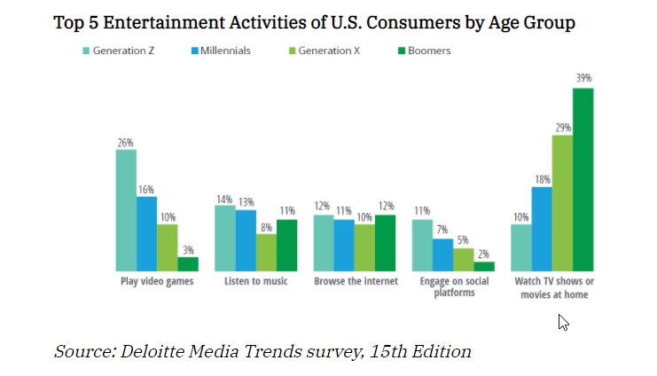
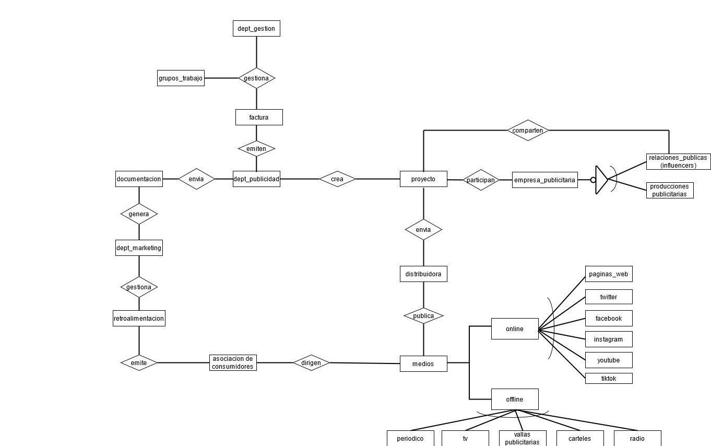
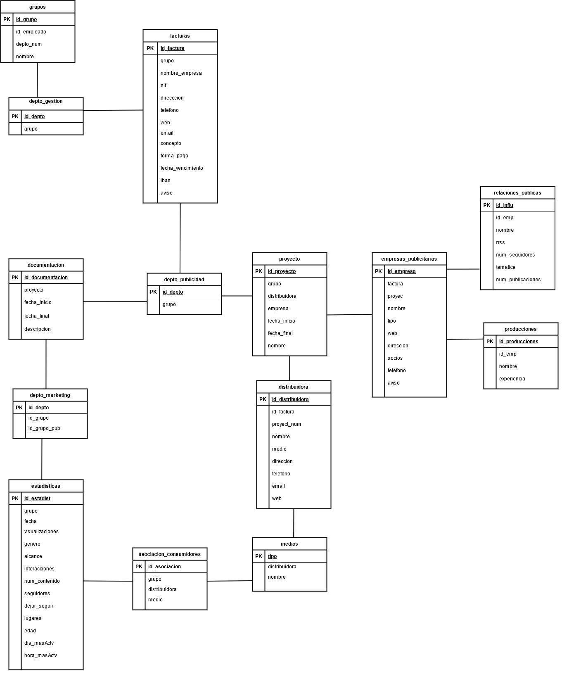
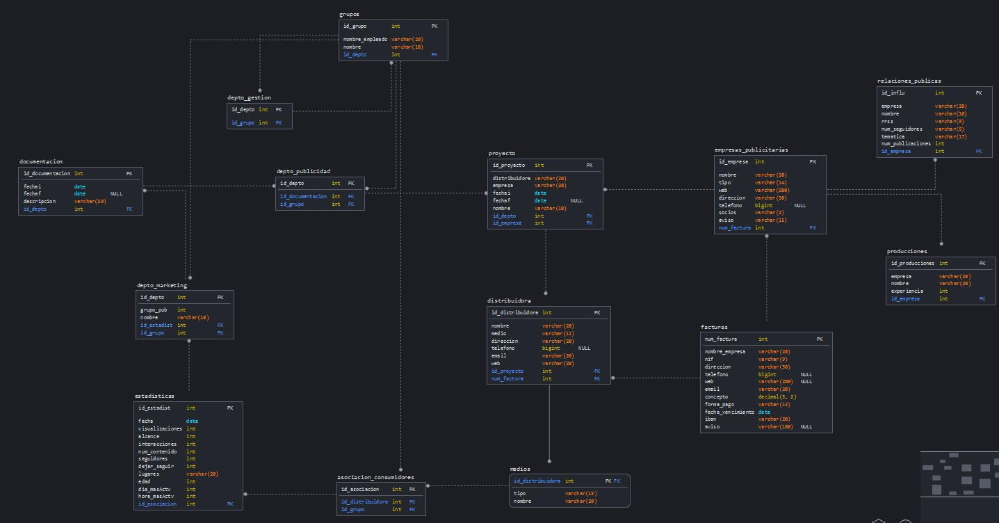

# Proyecto QuevedoFest

- [x] 1. [Introduccion](#Introduccion)
- [x] 2. [Modelo Conceptual](#Modelo-Conceptual)
   - [x] 2.1. [Especificaciones](#Especificaciones)
   - [x] 2.2. [Diagrama Entidad-Relación](#Diagrama-Entidad-Relacion)
- [x] 3. [Modelo Lógico](#Modelo-logico)
   - [x] 3.1. [Modelo Relacional](#Modelo-relacional)
   - [x] 3.2. [Normalización/Desnormalización](#Normalizacion)
- [x] 4. [Modelo Físico](#Modelo-fisico)
   - [x] 4.1. [Diagrama de base de datos](#Diagrama-de-Bases-de-Datos)(notación "Crow's feet" o IDEF1X) 
   - [x] 4.2. [Creación de tablas y otros objetos](#Creacion-de-Tablas)
   - [x] 4.3. [Carga de datos de prueba](#Carga-de-Datos-de-Prueba)
- [ ] 5. [Consultas de la base de datos](#Consultas-de-las-Bases-de-Datos)
   - [ ] 5.1. Consultas más frecuentes
   - [ ] 5.2. Consultas sencillas
   - [ ] 5.3. Consultas de agregación y resumen
   - [ ] 5.4. Consultas con subconsultas
- [ ] 6. Vistas, secuencias e índices
- [ ] 7. Scripts en PL/pgSQL
- [ ] 8. Extras
   - [ ] 8.1. Cursores
   - [ ] 8.2. Disparadores
   - [ ] 8.3. Prototipo de interfaz de usuario
   - [ ] 8.4. Plan de pruebas
   - [x] 8.5. Especificaciones de pruebas en [formato features Gherkin (ver ejemplo)](features/admin-carteles.feature) 
   - [ ] 8.6. Diagrama de clases
   - [ ] 8.7. Ejemplo de acceso a la base de datos con Java y JDBC

   1. [Seccion 1](#Seccion%20principal)


# Seccion principal
## Introduccion

He decidido realizar el trabajo sobre el area de comunicación de la empresa del festival de QuevedoFest, donde se dividen
en dos grandes grupos: márketing y publicidad. 

Cuando se habla de estrategia de marketing para festivales o eventos musicales se puede resumir en <u>vender la experiencia</u>.
En estos planes, la estrategia principal es convencer al posible público de asistir y que experimentará una experiencia única. Y
que en el momento en el que se consiga, asegurarse de su asistencia al año siguiente (o siguiente edición).

La estrategia de comunicación está ligada a realizar una perspectiva gira de medios, difundir la celebración del evento por redes sociales u otros, establecer canales de difusión, las formas de hacerlo y concretar campañas de comunicación novedosas para ganar la mayor visibilidad poblie, es decir que llegue a mucha cantidad de gente, que es el posible público o consumidor.

Para ello estudiaremos y segmentaremos el público objetivo, que lleva a ser buscar y estudiar los gustos del público al que quieres destinar
tu actividad. En este caso, en el Quevedo Fest, dirigiremos a el público más "_indie_" donde habrá una balanaza equilibrada de artistas _mainstreams_ e _indies_ . Conocer a tu publico significa caracterizarlos conociendo sus tendencias y preferencias del grupo.

Los festivales suele tener un precio algo elevado dentro de la economía de la gente. Por eso es importante destacar entre la competencia.

Una vez descritos los objetivos del área, vamos a definir los dos grupos donde se separan.

### Publicidad:

La publicidad se define por un conjunto de estrategias orientadas a dar a conocer productos y servicios a la sociedad. Es necesario realizar una comunicacion patrocinada para poder posicionarse en la mente del consumidor como <u>algo de buena calidad</u>.

Existen varios tipo de publicidad:

- Publicidad _offline_. Siendo los principales: publicidad en prensa, publicidad en radio, publicidad en TV, publicidad exterior o publicidad directa.

- Publicidad _online_. Existiendo un agran variedad: vídeo, anuncios en buscadores, display, redes sociales, email marketing, etc.

Dependiendo de los objetivos empresariales se deben utilizar unos formatos publicitarios u otros. En este caso intentaremos usar la gran mayoria de tipos, supondremos un presupuesto alto, pero sin aolvidarnos que nuestro público es joven; por lo que nos abstendremos de periódicos. Ya que la gran mayoría de jovenes consumen mucho más redes sociales y plataformas de streaming, aún así también se obtará por televisión, carteles y radio, ya que de vez en cuando el público lo consume.



### Marketing:

El marketing es el sistema de investigar un mercado, se responsabiliza de estudiar el comportamiento de los mercados y de las necesidades de los consumidores. Analiza la gestión comercial de las compañías con la finalidad de atraer, captar, retener y fidelizar a los clientes finales a través de la satisfacción de sus deseos y resolución de sus problemas, en este caso; algo banales.

Existen varios tipos de estrategias, en este caso vamos a emplear el marketing digital, viral, mobile, y el uso de redes sociales. A continuación, una breve explicación de cadas una:

- Marketing Digital o Marketing Online, es la disciplina del marketing que apuesta por desarrollar una estrategia en el entorno digital.

- Marketing Viral, es convertir tu anuncio en algo viral, que sorprenda y enganche la máximo público posible. 

- Mobile Marketing, es un concepto amplio que aglutina todas aquellas acciones y campañas de marketing focalizadas a los dispositivos móviles: smpartphones y tablets.

- Herramientas de Redes Sociales, aquellas herramientas gratis de marketing que te ayudarán a mejorar tu estrategia en Instagram, por ejemmplo, o la red social de moda y con el crecimiento exponencial más grande. Añadir aquí que Instagram tiene una opción de pago para la publicidad en su Red Social.

<!-- blank line -->

---

<!-- blank line -->

----

## Modelo Conceptual

### Especificaciones

Para explicar el modelo relacional del trabajo hay que empezar por la relación que hay entre Márketing y Publicidad, además, de las empresas y sectores laborales que que se contratan de forma externa a la empresa principal. 
Como márketing es la que se dedica a planear cómo se va a enfocar el producto y cómo se va a vender, son los que crean documentación sobre el público pensado, quién gestiona las facturas del departamento de Publicidad y quién analiza la respuesta del público en general. He querido que la parte de gestión de facturas y de grupos de trabajo lo haga otro departamento, departamento de Gestión para no sobresaturar el trabajo principal de márketing, ellos; van a crear grupos de trabajo para poder dividir el trabajo entre todos los empleados y tener algo de organización. Por otra parte, el departamento de publicidad se va a encargarse de hacer las contrataciones de las empresas externas y de captar ideas que márketing haya facilitado, es un trabajo más creativo ya que hay que construir las ideas más potentes que puedan captar el mayor número de consumidores.
Una vez que Publicidad tiene la idea pensada, el proyecto conjunto, cada uno de los grupos realizados por el departamento de Gestión, van a centrarse en según qué medios salga la publicidad; ya sea desde televisión (corto publicitario), radio (audio), periódico y vallas publicitarias (fotografía publicitaria y carteles), online (vídeos publicitarios de máx 5 minutos y personal encargada de gestionar las Redes Sociales) y búsqueda de celebridades que promocionen el evento.

Para ello, el proyecto tiene que contar, con al menos; tres empresas externas: una productora para el corto publicitario, la agencia publicitaria que disponga de fotógrafos, actores y actrices y una distribuidora.

La distribuidora es aquella que se encargará de emitir y expandir todo el proyecto en todas las plataformas que márketing ha planeado usar. Esto lo podría hacer el mismo departamento publicitario pero al no encontrar mucha información sobre este tipo de tratos y favores entre empresas(incluso a veces hasta el Gobierno), de si se necesita o no ciertas licencias, he preferido dejarlo en manos de una empresa externa, que me haría el trabajo más laborioso.

Cuando el proyecto sale a la luz, se lee en Redes sociales el numero de veces compartido, 'likeado', comentarios, el número de veces que se entra en la página web (si es que se tiene), encuestas, valoraciones y estadísticas de la celebridad contratada... todos esos datos son recogidos por la asociación de Consumidores, que emitirá un documento para el departamento de Márketing que les ayudará a saber cómo reenfocar, si es necesario; los siguientes planes para seguir ganando más público, emitiendo al mismo tiempo otro documento para que publicidad siga haciendo su trabajo, si buscar algo más agresivo o mantenerse en la línea. Vuelve el ciclo a empezar.


### Diagrama Entidad-Relacion

En este primer prototipo de diagrama, se ha incluido algunas tablas extras que no estaban en un principio en el esquema principal, como la Asociación de Consumidores, distribuidora y empresas publicitarias. Se han realizado varias versiones de la tabla.




## Modelo Lógico

### Modelo Relacional



### Normalizacion

dept_gestion: id
grupos_trabajo: id, fk_dept (FK)
factura: id, nombre, cantidad, concepto
dept_publicidad: id, id_proyecto (FK)
proyecto: id, nombre, concepto
empresa_publicitaria: id, factura_fk (FK)
distribuidora: id, factura_fk (FK)
medios: id
asociacion_consumidores: id
retroalimentacion: informacion, fecha
dept_marketing: id
documentacion: id, fecha, informacion

No está en primera forma normal porque tiene elementos multivaluados, para solucionarlo se tendría que crear tablas con todos ellos, como empresa_publicitaria y medios. Está en segunda forma normal, porque existe una relacion entre tablas, y está en tercera forma normal porque hay tablas que se relacionan con sus claves primarias.

## Modelo Físico

Tablas explicadas:

| facturas        |
|-----------------|
| num_factura (PK) | 
| id_proyct       |
| id_empresa      |
| nif             | 
| direccion       | 
| telefono        | 
| web             | 
| email           | 
| concepto        |
| forma_pago      | 
| fecha_vencimiento| 
| iban            | 
| aviso           | 

Tabla `facturas` se almacenan los datos qque van dentro de una factura, el id del proyecto `id_proyect`, que va vinculada a el `id_grupo` que lo ha llevado a cabo. Datos que la forman: `num_factura`, `id_proyect`, `id_empresa`, `concepto` como pago a la empresa por los servicios, que son tipo int y, `nif`, `direccion`, `telefono`, `web`, `email`, `forma_pago` como método de pago, `fecha_vencimiento`, `aviso` como caja de texto donde se adjunta si la relación ha sido buena o mala, `iban` de tipo String. He decicido cambiarle de lugar ya que he eliminado el depto gestion, porque no me servía de mucho y esto creo que mejor cerca de las empresas que generan facturas. No todas, por eso, algunos datos se repiten, ya que en las facturas siempre tiene que estar toda la información.

| depto_publicidad |           
|-----------------|
| id_depto (PK)   | 
| id_doc          | 

El departamento de publicidad es el que se encarga de producir y de emitir el proyecto según las indicaciones de marketing. Habrá un proyecto diferente dependiendo del enfoque publicitario que haya. Por ejemplo, no es lo mismo el contenido que se subre en redes como Instagram, que el que crea contenido para Youtube o para la televisión. La tabla `depto_publicidad` están de atributos:
`id_depto`, `id_doc`, `id_proy` de tipo int.

| proyecto        |
|-----------------|
| id_proyecto(PK) |
| id_doc          |
| nombre          |
| fechai          |
| fechaf          |
| id_distribuidora|
| id_empresaP     |

Tabla `proyecto` para almacenar datos relevantes sobre este, como `id_proyecto`, `id_doc`, `id_distribuidora`, `id_empresaP` de tipo int y `nombre`, `fechai`, `fechaf` de tipo String.

| empresas_publicitarias|           
|-----------------|
| id_empresa (PK) | 
| nombre          |
| tipo            | 
| email           |
| web             | 
| direccion       | 
| socios          | 
| telefono        |
| factura         |
| aviso           |  

Listado de empresas posibles con las que trabajar, aquí incluimos agencias, representantes y empresas producctoras de contenido. `socios` es la casilla donde se escribirá si se ha trabajado varias veces con ellos, al mismo tiempo que en `aviso` se escribirán conceptos que puedan ir ocurrriendo, como que ha trabajado para la competencia ese mismo año o que no están disponibles. La tabla `empresas_publicitarias` tiene los siguientes atributos: `id_empresa`, `factura` que son de tipo int y `nombre`, `iban`, `tipo`, `email`, `web`, `direccion`, `socios`, `telefono`, `aviso` como tipo VARCHAR().

| distribuidora   |           
|-----------------|
| id_distribuidora (PK)| 
|proyecto_id      |
| nombre          |
| medio           | 
| web             | 
| email           |
| direccion       | 
| telefono        |
| factura         |

Empresa que se dedica a distribuir la multimedia por los medios de comunicación que tengan por cliente, por eso hay distinciones. Cada empresa tiene un sector, algunas son unicamente para televisión y radio pero otras están enfocadas en RRSS, como la compra de banners de algunas páginas webs. La tabla `distribuidora` tiene los atributos: `id_distribuidora`, `factura` como tipo int y `nombre`, `medio`, `web`, `email`, `direccion`, `telefono` como tipo VARCHAR().

| relaciones_publicas|           
|-----------------|
| id_infl (PK)    | 
| id_emp          |
| nombre          |
| cuenta_rrss     | 
| num_seguidores  | 
| tematica        | 
| num_publicaciones|

Autónomos que se dedican a hacer publicidad por Redes Sociales, como influencers, celebridades, actrices, modelos, etc... `tematica`es la definición de su cuenta, como beauty blogger, moda, música, comedia, etc... Estos son contratados a través de sus agencias o representantes. El atributo `experiencia` tiene su valor en años int.
La tabla `relaciones_publicas` se compone de los atributos: `id_infl`, `id_emp`, `num_publicaciones`(número de publicaciones), `num_seguidores` como tipos INT, y `nombre` (donde pondríamos el nombre artístico), `cuenta_rrss` y `tematica` como String.

| producciones    |
|-----------------|
| id_empresa (PK) |
| nombre          |
| experiencia     |

`producciones` 

| medios          |
|-----------------|
| nombre          | 
| id_distribuidora|


| asociacion_consumidores|
|-----------------|
| id (PK)         | 
| tipo_medio      |
| id_estadistica  |
| id_grupo        |

`asociacion_consumidores`es la entidad que se dedica a recopilar información y crear `estadiasticas` sobre la pubñicidad lanzada. Todo ello cedido por las empresas distribuidoras, que se encargan de emitir los proyectos.

| estadisticas    |
|-----------------|
| id_estadist (PK)| 
| fecha           |
| visualizaciones |
| genero          | 
| alcance         | 
| interacciones   | 
| num_contenido   | 
| seguidores      | 
| dejar_seguir    |
| lugares         | 
| edad            | 
| dia_masActv     | 
| hora_masActv    | 

| depto_marketing |
|-----------------|
| id_depto (PK)   | 
| nombre           |
| estadist         |

`depto_marketing`se va a encargar de emitir un comunicado de los cambios y enfoques que haya que hacer para poder abarcar bastante público, así el departamento de publicidad saben exactamente qué hacer.

| documentacion  |
|-----------------|
| id_documentacion (PK)| 
| id_proyecto     |
| id_grupo        |
| fecha_inicio    |
| fecha_final     |
| descripcion     |


### Diagrama de Bases de Datos




### Creacion de Tablas

```sql
-- PostgreSQL
--
-- Database: quevedoFest
-- -----------------------------------
DROP TABLE IF EXISTS grupos;
DROP TABLE IF EXISTS depto_gestion;
DROP TABLE IF EXISTS facturas;
DROP TABLE IF EXISTS depto_publicidad;
DROP TABLE IF EXISTS proyecto;
DROP TABLE IF EXISTS empresas_publicitarias;
DROP TABLE IF EXISTS relaciones_publicas;
DROP TABLE IF EXISTS producciones;
DROP TABLE IF EXISTS distribuidora;
DROP TABLE IF EXISTS medios;
DROP TABLE IF EXISTS asociacion_consumidores;
DROP TABLE IF EXISTS estadisticas;
DROP TABLE IF EXISTS depto_marketing;
DROP TABLE IF EXISTS documentacion;

CREATE TABLE depto_gestion (
  id_depto int NOT NULL,
    grupo int NOT NULL,
  
  CONSTRAINT gestion_pk PRIMARY KEY (id_depto)
);


CREATE TABLE grupos (
  id_grupo int NOT NULL,
  depto int NOT NULL,
  nombre_empleado varchar(20) NOT NULL,
  nombre varchar(10) NOT NULL,

  CONSTRAINT grupo_pk PRIMARY KEY (id_grupo)
);


ALTER TABLE depto_gestion ADD FOREIGN KEY (grupo) REFERENCES grupos (id_grupo);

CREATE INDEX gestion_idx ON depto_gestion(
    grupo
);

CREATE INDEX grupos_idx ON grupos(
    depto
);

CREATE TABLE facturas (
  num_factura int NOT NULL,
  nombre_empresa varchar(20) NOT NULL,
  nif varchar(9) NOT NULL,
  direccion varchar(50) NOT NULL,
  telefono bigint DEFAULT NULL,
  web varchar(200) DEFAULT NULL,
  email varchar(20) NOT NULL,
  concepto decimal(5, 2) NOT NULL,
  forma_pago varchar(13) NOT NULL DEFAULT 'transferencia',
  fecha_vencimiento date NOT NULL,
  iban varchar(20) NOT NULL,
  aviso varchar(100),

  CONSTRAINT num_factura_pk PRIMARY KEY (num_factura),
  CONSTRAINT pago_ck CHECK (forma_pago IN ('transferencia', 'cheque'))
);


CREATE TABLE depto_publicidad (
  id_depto int NOT NULL,
  grupo int NOT NULL,
  documentacion int NOT NULL,

  CONSTRAINT publicidad_pk PRIMARY KEY (id_depto),
  CONSTRAINT grupo_fk FOREIGN KEY (grupo) 
    REFERENCES grupos (id_grupo)
);

CREATE INDEX publiGrp_idx ON depto_publicidad(
 grupo
);

CREATE TABLE proyecto (
  id_proyecto int NOT NULL,
  depto int NOT NULL,
  empresa int NOT NULL,
  distribuidora int NOT NULL,
  fechai date NOT NULL,
  fechaf date DEFAULT NULL,
  nombre varchar(10) NOT NULL,

  CONSTRAINT proyecto_pk PRIMARY KEY (id_proyecto),
  CONSTRAINT depto_fk FOREIGN KEY (depto) 
    REFERENCES depto_publicidad (id_depto)
);

CREATE INDEX proytDept_idx ON proyecto(
 depto
);


CREATE TABLE empresas_publicitarias(
  id_empresa int NOT NULL,
  factura int NOT NULL,
  proyect int NOT NULL,
  nombre varchar(20) NOT NULL,
  tipo varchar(14) NOT NULL DEFAULT 'agencia',
  web varchar(200) NOT NULL,
  direccion varchar(50) NOT NULL,
  telefono bigint DEFAULT NULL,
  socios varchar(2) NOT NULL DEFAULT 'no',
  aviso varchar(15) NOT NULL DEFAULT 'libre',

  CONSTRAINT empresa_pk PRIMARY KEY (id_empresa),
  CONSTRAINT factura_fk FOREIGN KEY (factura) 
    REFERENCES facturas (num_factura),
  CONSTRAINT proyecto_fk FOREIGN KEY (proyect) 
    REFERENCES proyecto (id_proyecto),
  CONSTRAINT tipo_ck CHECK (tipo IN ('representacion', 'agencia', 'produccion')),
  CONSTRAINT socio_ck CHECK (socios IN ('si', 'no')),
  CONSTRAINT aviso_ck CHECK (aviso IN ('libre', 'con competencia', 'cerrado', 'no disponible'))
);

CREATE INDEX empFact_idx ON empresas_publicitarias
(
 factura
);

CREATE INDEX empProy_idx ON empresas_publicitarias
(
 proyect
);

CREATE TABLE relaciones_publicas (
  id_influ int NOT NULL,
  empresa int NOT NULL,
  nombre varchar(10) NOT NULL,
  rrss varchar(9) NOT NULL DEFAULT 'instagram',
  num_seguidores varchar(5) NOT NULL,
  tematica varchar(17) NOT NULL DEFAULT 'personaje publico',
  num_publicaciones int NOT NULL DEFAULT '00',

  CONSTRAINT realaciones_pk PRIMARY KEY (id_influ),
  CONSTRAINT empresa_fk FOREIGN KEY (empresa) REFERENCES empresas_publicitarias (id_empresa),
  CONSTRAINT rrss_ck CHECK (rrss IN ('instagram', 'twitter', 'tiktok')),
  CONSTRAINT tematica_ck CHECK (tematica IN ('beauty', 'vlog', 'videogame', 'modelo', 'actor', 'viajes'))
);

CREATE INDEX relac_idx ON relaciones_publicas(
    empresa
);

CREATE TABLE producciones (
  id_producciones int NOT NULL,
  empresa int NOT NULL,
  nombre varchar(20) NOT NULL,
  experiencia int NOT NULL,

  CONSTRAINT producciones_pk PRIMARY KEY (id_producciones),
  CONSTRAINT empresa_fk FOREIGN KEY (empresa) REFERENCES empresas_publicitarias (id_empresa)
);

CREATE INDEX prod_idx ON producciones(
    empresa
);


CREATE TABLE distribuidora (
  id_distribuidora int NOT NULL,
  proyecto int NOT NULL,
  factura int NOT NULL,
  nombre varchar(20) NOT NULL,
  medio varchar(11) NOT NULL DEFAULT 'audiovisual',
  direccion varchar(20) NOT NULL,
  telefono bigint DEFAULT NULL,
  email varchar(20) NOT NULL,
  web varchar(20) NOT NULL,

  CONSTRAINT distribuidora_pk PRIMARY KEY (id_distribuidora),
  CONSTRAINT proyecto_fk FOREIGN KEY (proyecto) 
    REFERENCES proyecto (id_proyecto),
  CONSTRAINT factura_fk FOREIGN KEY (factura) 
    REFERENCES facturas (num_factura),
  CONSTRAINT medio_ck CHECK (medio IN ('audiovisual', 'audio', 'fotografia'))
);

CREATE INDEX distrProy_idx ON distribuidora
(
 proyecto
);

CREATE INDEX distrDist_idx ON distribuidora
(
 factura
);


CREATE TABLE medios (
  distribuidora int NOT NULL,
  tipo varchar(18) NOT NULL DEFAULT 'television',
  nombre varchar(20) NOT NULL,

  CONSTRAINT distribuidoraM_pk PRIMARY KEY (distribuidora),
  CONSTRAINT distribuidoraM_fk FOREIGN KEY (distribuidora) 
    REFERENCES distribuidora (id_distribuidora),
  CONSTRAINT tipo_ck CHECK (tipo IN ('television', 'radio', 'rrss', 'vallas publicitarias', 'cine'))
);

CREATE INDEX medDist_idx ON medios
(
 distribuidora
);


CREATE TABLE asociacion_consumidores (
  id_asociacion int NOT NULL,
  grupo int NOT NULL,
  distribuidora int NOT NULL,

  CONSTRAINT asociacion_pk PRIMARY KEY (id_asociacion),
  CONSTRAINT grupo_fk FOREIGN KEY (grupo) 
    REFERENCES grupos (id_grupo),
  CONSTRAINT distribuidoraM_fk FOREIGN KEY (distribuidora) 
    REFERENCES medios (distribuidora)
);

CREATE INDEX asociDist_idx ON asociacion_consumidores(
    distribuidora
);

CREATE INDEX asociGrp_idx ON asociacion_consumidores(
    grupo
);


CREATE TABLE estadisticas (
  id_estadist int NOT NULL,
  asociacion int NOT NULL,
  fecha date NOT NULL,
  visualizaciones int NOT NULL,
  genero varchar(10) NOT NULL DEFAULT 'no binario',
  alcance int DEFAULT NULL,
  interacciones int DEFAULT NULL,
  num_contenido int DEFAULT NULL,
  seguidores int NOT NULL,
  dejar_seguir int NOT NULL,
  lugares varchar(20) NOT NULL,
  edad int NOT NULL,
  dia_masActv int NOT NULL,
  hora_masAct int NOT NULL,

  CONSTRAINT estadistica_pk PRIMARY KEY (id_estadist),
  CONSTRAINT asociacionE_fk FOREIGN KEY (asociacion) 
    REFERENCES asociacion_consumidores (id_asociacion),
  CONSTRAINT genero_ck CHECK (genero IN ('femenino', 'masculino', 'no binario'))
);

CREATE INDEX estad_idx ON estadisticas(
    asociacion
);


CREATE TABLE depto_marketing (
  id_depto int NOT NULL,
  grupoNombre int NOT NULL,
  nombre varchar(10) NOT NULL,
  estadist int NOT NULL,

  CONSTRAINT marketing_pk PRIMARY KEY (id_depto),
  CONSTRAINT grupoMk_fk FOREIGN KEY (grupoNombre) 
    REFERENCES grupos (id_grupo),
  CONSTRAINT estadist_fk FOREIGN KEY (estadist) 
    REFERENCES estadisticas (id_estadist)
);

CREATE INDEX markGrp_idx ON depto_marketing(
    grupoNombre
);

CREATE INDEX markEs_idx ON depto_marketing(
    estadist
);

CREATE TABLE documentacion (
  id_documentacion int NOT NULL,
  depto int NOT NULL,
  fechai date NOT NULL,
  fechaf date,
  descripcion varchar(20) NOT NULL,

  CONSTRAINT documentacion_pk PRIMARY KEY (id_documentacion),
  CONSTRAINT deptoMk_fk FOREIGN KEY (depto) 
    REFERENCES depto_marketing (id_depto)
);

CREATE INDEX doc_idx ON documentacion(
    depto
);

----------------------

ALTER TABLE depto_publicidad
  ADD FOREIGN KEY (documentacion)
  REFERENCES documentacion ( id_documentacion );

CREATE INDEX publiDoc_idx ON depto_publicidad(
 documentacion
);


ALTER TABLE proyecto ADD FOREIGN KEY (empresa) 
  REFERENCES empresas_publicitarias (id_empresa);

CREATE INDEX proycEmp_idx ON proyecto(
 empresa
);

ALTER TABLE proyecto ADD FOREIGN KEY (empresa) 
  REFERENCES empresas_publicitarias (id_empresa);
CREATE INDEX markEs_idx ON depto_marketing(
    estadist
);


ALTER TABLE proyecto ADD FOREIGN KEY (distribuidora) 
    REFERENCES distribuidora (id_distribuidora);

CREATE INDEX proytDist_idx ON proyecto(
 distribuidora
);
CREATE INDEX proytEmp_idx ON proyecto(
 empresa
);
```

### Carga de Datos de Prueba


```sql
--INSERTS

INSERT INTO asociacion_consumidores (id_asociaciones, distribuidora)
VALUES (1000, 10), (2000, 30);

INSERT INTO depto_marketing (id_depto, nombre, estadist)
VALUES (3, 'analisis mercado', 1010), (4, 'analisis publico', 2020), (4, 'analisis general', 3030);

INSERT INTO depto_publicidad (id_depto, documentacion)
VALUES (1, 204), (2, 205), (3, 206);

INSERT INTO distribuidora (id_distribuidora, proyecto, factura, nombre, medio, direccion, telefono, email, web)
VALUES (10, 306, 770, 'Flash S.A.', 'audiovisual', 'calle alcala, 200', 734238123, 'flash@gmail.com', 'www.flash.com'),
  (20, 304, 660, 'TVespaña S.A.', 'audiovisual', 'calle alcala, 150', 734456723, 'tvespañah@gmail.com', 'www.tvespaña.com'),
  (30, 306, 550, 'Gallery studio S.A.', 'fotografia', 'calle alcala, 203', 908238123, 'gallerystudio@gmail.com', 'www.gallerystudio.com');

INSERT INTO documentacion (id_documentacion, depto, fechai, fechaf, descripcion)
VALUES (204, 3, '01/02/2010', '03/04/2010', 'reenfoque'), (205, 3, '03/20/2010', '04/30/2010', 'persistir'), (206, 3, '05/10/2010', '06/30/2010', 'mas juventud');

INSERT INTO empresas_publicitarias(id_empresa, factura, proyect, nombre, tipo, web, direccion, telefono, socios, aviso)
VALUES (50, 990, 306, 'blueberry S.A.', 'produccion', 'blueberry.com', 'calle atocha, 23', 394827139, 'si', 'libre'),
  (70, 110, 304, 'Agencia Miranda S.A.', 'representacion', 'mirandaTalends.com', 'calle atocha, 50', 393957139, 'no', 'libre'),
  (80, null, 304, 'Agencia River S.A.', 'representacion', 'riveragency.com', 'calle atocha, 50', 393957139, 'si', 'cerrado');

INSERT INTO estadisticas (id_estadist, asociacion, fecha, visualizaciones, genero, alcance, interacciones, num_contenido, seguidores, dejar de seguir, lugares, edad, dia_masactv, hora_masact)
VALUES (1010, 1000, '12/01/2009', null, 'no binario', null, null, null, 0, 0, 'españa', 20, 'viernes', 18), (2020, 2000, '03/01/2010', 43556, 'femenino', 5000, 3445, 20, 67970, 890, 'madrid', 25, 'jueves', 19), (3030, 2000, '06/02/2009', 6058344, 'femenino', 45926, 850, 80, 67970, 300, 'barcelona', 25, 'viernes', 18);

INSERT INTO facturas (num_factura, nombre_empresa, nif, direccion, telefono, web, email, concepto, forma_pago, fecha_vencimiento, iban, aviso)
VALUES (990, 'blueberry S.A.', 'K94837209', 'calle atocha, 23', 394827139, 'blueberry.com', 'blue@gmail.com', 10890.34, 'transferencia', '10/09/1010', 'ES123456789098765432', 'pago realizado'), (110, 'Agencia Miranda S.A.', 'M94837084', 'calle atocha, 50', 345765987, 'mirandaTalends.com', 'mirandaTalends.com', 'cheque', '11/20/2010', 'ES948372456299857432', 'hacer pago urge');

INSERT INTO medios(distribuidora, tipo)
VALUES (10, 'rrss'), (20, 'television'), (30, 'vallas publicitarias');

INSERT INTO producciones(id_producciones, empresa, experiencia)
VALUES (567, 50, 5), (568, 70, 1), (569, 80, 15);

INSERT INTO proyecto(id_proyecto, depto, empresa, distribuidora, fechai, fechaf, nombre)
VALUES (306, 2, 50, 10, '12/15/2009', '03/12/2010', 'Plan A'), (304, 3, 70, 30, '02/03/2010', '31/07/2010','Plan B');

INSERT INTO relaciones_publicas(id_influ, empresa, nombre, rrss, num_seguidores, tematica, num_publicaciones)
VALUES (12, 70, 'amargaceida', 'instagram', 32000, 'vlog', 2003), ();
```

## Consultas de la Base de Datos

### Consultas mas frecuentes

1. ¿Qué empresas están trabajando para X proyecto?
2. ¿Qué empresas están cerradas? ¿Y libres?
3. Información sobre la última retroalimentación, estadísticas.
4. ¿Ha aumentado el alcance con los últimos cambios realizados?

### Consultas mas secillas

1. Muestra todas las empresas con las que se ha trabajado.
2. Muestra las empresas que se dediquen a la representacion.
3. Muestra la/el influencers con más seguidores.
4. Muestra las facturas que flaten por pagar.

### consultas de agrecacion y resumen

### Consultas con subconsultas

## Vistas, Secuencias e Indices

## Scripts en PL/pgSQL


### Recursos
https://www.cyberclick.es/publicidad
http://www.asap.com.ve/blog/marketing-y-publicidad
https://www.cicerocomunicacion.es/diferencias-marketing-publicidad/
https://www.w3schools.com/
https://github.com/thlorenz/doctoc/blob/master/README.md
https://victorhckinthefreeworld.com/2019/03/07/enlaces-internos-a-partes-de-un-documento-en-formato-markdown/

### Herramientas
DBeaver
Visual Studio Code
Postgres shell
https://app.sqldbm.com


